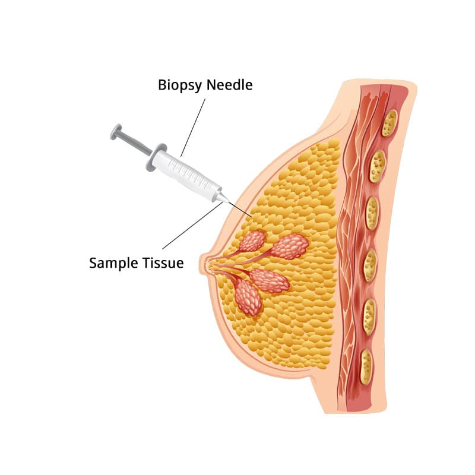

# An introduction to our problem

## Types of tumors


Our task is to find these malignant tumors, so the corresponding patients can get treated with chemotherapy, or other treatments.

Our dataset will contain details about these tumors and we should ```classify``` if they are benign or malignant.

## Dataset

### Fine needle aspiration
*Fine needle aspiration:* A type of biopsy procedure. In fine needle aspiration, a thin needle is inserted into an area of abnormal-appearing tissue or body fluid. As with other types of biopsies, the sample collected during fine needle aspiration can help make a diagnosis or rule out conditions such as cancer.

Our data is derived from this particular examination.



The dataset looks like this:

 

Breakdown of the variables:
* ```diagnosis```:
    - 0: Malignant Tumor
    - 1: Banign Tumor
* ```radius_mean```
* ```texture_mean```
* ```perimeter_mean```
* ```area_mean```
* ```smoothness_mean```
* ```compactness_mean```
* ```concavity_mean```
* ```concave_points_mean```
* ```symmetry_mean```
* ```fractal_dimensional_mean```

We're gonna use a ML model (Logistic Regression) to find some relationship between the data and train our predictive model.
